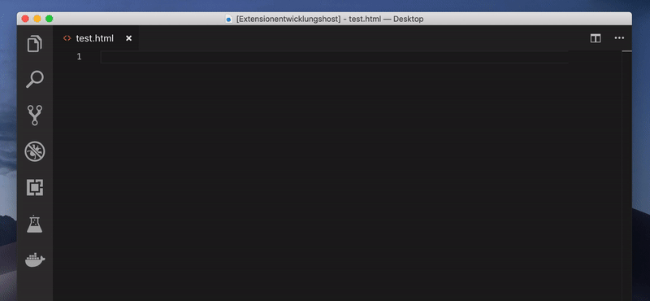

# VSCode Completion for A-Frame

This extension adds completions for the A-Frame primitives and their attributes.



## Primitive Completion

Type `a` or `a-` to start the completion and get a list of all primitives (`a-box`, `a-entity`, `a-sky`, etc.).

## Attribute Completion

Inside a primitive tag you get an overview and completion of all corresponding attributes (`color`, `position`, `scale`, etc.).

## Snippets

Type `AFRAME.registerComponent` to insert:

```javascript
AFRAME.registerComponent('component-name', {
	schema: {
		
	},

	init: function () {
	  // Do something when component first attached.
	},

	update: function () {
	  // Do something when component's data is updated.
	},

	remove: function () {
	  // Do something the component or its entity is detached.
	},

	tick: function (time, timeDelta) {
	  // Do something on every scene tick or frame.
	}
});
```

Type `a-scene:example` to insert a basic A-Frame scene:
```html
<a-scene background="color: #FAFAFA">
	<a-box position="-1 0.5 -3" rotation="0 45 0" color="#4CC3D9" shadow></a-box>
	<a-sphere position="0 1.25 -5" radius="1.25" color="#EF2D5E" shadow></a-sphere>
	<a-cylinder position="1 0.75 -3" radius="0.5" height="1.5" color="#FFC65D" shadow></a-cylinder>
	<a-plane position="0 0 -4" rotation="-90 0 0" width="4" height="4" color="#7BC8A4" shadow></a-plane>
</a-scene>
```